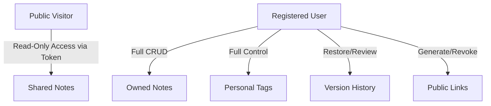

# Functional Requirements Specification (FRS)

## Project: Note Note-Taking Platform

**Project Code:** textAB  
**Version:** 1.0.0-Release  
**Author:** Product Engineering Team

---

# 1. Product Vision & Personas

## 1.1 Product Vision

Note is a secure, light-weight web-based workspace designed to help users capture thoughts, organize knowledge, search contextually, and share documents safely. It features robust version snapshotting, tagging, and immediate searchability, acting as a personal knowledge base.

## 1.2 User Personas

To ensure functional specifications address real needs, Note features are aligned with two primary user personas:

### Sarah (The Academic Researcher)

- **Goal:** Needs to capture extensive research logs and structure them with high-fidelity tags.
- **Pain Point:** Accidental overwrites, losing previous ideas, and difficulty searching through hundreds of pages of text.
- **Note Solution:** Automatic version snapshots, tag-based grouping, and lightning-fast full-text search.

### Dave (The Software Engineer)

- **Goal:** Quick code snippet logging and sharing specifications securely with clients via links.
- **Pain Point:** Sharing draft notes that should expire automatically and not having a clean, simple interface.
- **Note Solution:** Secure shareable link generation with custom expiration dates and clean markdown presentation.

---

# 2. Scope Matrix

The scope of Note is carefully scoped to maintain a lightweight, highly responsive system architecture.

| Core Capabilities (In-Scope)                                                                                       | Deferred Capabilities (Out-of-Scope)                                                |
| :----------------------------------------------------------------------------------------------------------------- | :---------------------------------------------------------------------------------- |
| **Identity Management:** Email/password register, secure JWT-based sessions, and console-logged OTP verification.  | **Third-party Logins:** Social logins, OAuth 2.0, or SSO integrations.              |
| **Drafting Canvas:** Rich text drafting, tag association, and automatic local-to-cloud sync (autosave).            | **Complex Layouts:** Sub-notebooks, nested folders, or tree-structured hierarchies. |
| **Search Engine:** Indexed PostgreSQL full-text search across titles and note bodies with highlighted query terms. | **Media Library:** Image, video, and file attachment uploads.                       |
| **Snapshot History:** Chronological snapshot tracking with single-click restoration.                               | **Real-Time Workspace:** Concurrent multi-user live editing (collaboration).        |
| **Secure Share links:** Generating read-only public URLs with validation checks (expiry/revoking).                 | **Distribution Channels:** Dedicated desktop and mobile clients.                    |
| **Soft Trashing:** 30-day trash retention for recoverable notes.                                                   | **Notification System:** Production email SMTP delivery networks.                   |

---

# 3. User Roles & Access Permissions

We define two levels of access control for the platform:

### 3.1 Registered User

- **Access Scope:** Authenticates via secure credentials.
- **Privileges:** Can perform full CRUD actions on owned notes and tags, search their repository, configure share tokens, view their own version histories, and restore any previous snapshot.

### 3.2 Public Viewer

- **Access Scope:** Anonymous internet user possessing a specific cryptographic link.
- **Privileges:** Read-only access to the targeted note. Cannot see version history, cannot edit, and cannot search other user notes.

---

# 4. Functional Specifications

## 4.1 Authentication & Security

### 4.1.1 Account Registration

- **Description:** Allow new users to create accounts using their email and a strong password.
- **Acceptance Criteria:**
  1. The system shall accept a unique email address and a validated password.
  2. Passwords must be hashed using a strong cryptographically secure hashing algorithm before storage.
  3. Upon successful registration, the API must return active access and refresh tokens.
  4. Attempting registration with a duplicate email must throw a clear validation error.
- **Password Validation Rules:**
  - Minimum length of 8 characters.
  - Must contain at least one uppercase character, one lowercase character, and one numeric digit.

> [!WARNING]
> Under no circumstances should passwords be stored in plaintext. Password hashing must happen in the backend immediately on receipt.

#### Registration Error Handling

| Case                      | REST Status                | Message                                      |
| :------------------------ | :------------------------- | :------------------------------------------- |
| Email already registered  | `422 Unprocessable Entity` | Email already exists in the system           |
| Email format invalid      | `400 Bad Request`          | Invalid email address format                 |
| Password policy violation | `400 Bad Request`          | Password does not meet security requirements |

---

### 4.1.2 Session Authentication (Login)

- **Description:** Verify user credentials to issue session tokens.
- **Acceptance Criteria:**
  1. Users providing correct email/password pairs shall receive a short-lived access token and a long-lived refresh token.
  2. The system must persist the refresh token inside the database to manage active sessions.
  3. Invalid combinations must trigger a generic security failure to prevent email harvesting.

#### Login Error Handling

| Case                               | REST Status        | Message                                |
| :--------------------------------- | :----------------- | :------------------------------------- |
| Password mismatch / User not found | `401 Unauthorized` | Invalid email or password credentials  |
| Missing mandatory parameters       | `400 Bad Request`  | Email and password are required fields |

---

### 4.1.3 Session Termination (Logout)

- **Description:** Securely end user sessions and revoke refresh tokens.
- **Acceptance Criteria:**
  1. The API must invalidate and remove the active refresh token from the database.
  2. The access token should become effectively useless upon normal expiration.
  3. The logout action must clear cookies/tokens on the client side.

---

### 4.1.4 Password Reset Request (Forgot Password)

- **Description:** Allow users to request an OTP (One-Time Password) to reset their credentials.
- **Acceptance Criteria:**
  1. On request, the system generates a secure 6-digit numeric OTP valid for 10 minutes.
  2. The generated OTP shall be written directly to the server console log (mock delivery mechanism).
  3. Generating a new OTP for the user must invalidate any previously generated OTPs for that user.

> [!NOTE] > **Anti-Enumeration Guard:** To prevent attackers from checking registered email addresses, the `/forgot-password` endpoint will always respond with `HTTP 200 Success`, irrespective of whether the email exists in the database.

#### OTP Generation Errors

| Case        | REST Status       | Message                                   |
| :---------- | :---------------- | :---------------------------------------- |
| OTP expired | `410 Gone`        | The requested validation code has expired |
| OTP invalid | `400 Bad Request` | The provided validation code is incorrect |

---

### 4.1.5 Password Reset Execution

- **Description:** Allow password updates using a valid OTP.
- **Acceptance Criteria:**
  1. Users must supply a valid OTP to authorize a password update.
  2. The new password must satisfy the standard password strength validation rules.
  3. Upon password change, all outstanding refresh tokens for that user must be revoked to force re-authentication.
  4. The OTP must be immediately invalidated post-use.

---

## 4.2 Document Workspace & Notes

### 4.2.1 Document Creation

- **Description:** Authenticated users can create new empty or structured notes.
- **Acceptance Criteria:**
  1. A note must include a title (default fallback if blank) and body content.
  2. Notes are strictly scoped to the creator (multi-tenant isolation).
  3. Notes are allowed to be completely empty of body content.
  4. Every creation must automatically create version `1` of the note in history.
  5. Background autosave must periodically commit changes to prevent loss.

#### Note Creation Errors

| Case                        | REST Status        | Message                                       |
| :-------------------------- | :----------------- | :-------------------------------------------- |
| Token invalid/missing       | `401 Unauthorized` | Authentication credentials missing or invalid |
| Invalid JSON body structure | `400 Bad Request`  | Invalid payload structure                     |

---

### 4.2.2 Document Retrieval

- **Description:** Retrieve list of user notes or view detailed note content.
- **Acceptance Criteria:**
  1. Users can query their repository with support for pagination, sorting (by creation/update dates), and tag filters.
  2. By default, soft-deleted notes are hidden from the active notes list.
  3. Users are strictly blocked from retrieving notes owned by other accounts.

---

### 4.2.3 Document Editing

- **Description:** Modify note titles, text content, and tag associations.
- **Acceptance Criteria:**
  1. Changing a note must update the `updatedAt` timestamp metadata.
  2. Saving changes (manually or via autosave) must automatically create a new incremental version snapshot in history.
  3. Tag associations are dynamically updated on note save.

---

### 4.2.4 Soft Deletion & Recovery

- **Description:** Move notes to a trash state without permanently deleting them.
- **Acceptance Criteria:**
  1. Deletion triggers a soft delete, setting a `deletedAt` timestamp.
  2. Soft-deleted documents do not show up in search results or normal workspace lists.
  3. Soft-deleted notes are retained for exactly 30 days, during which the owner can fully restore them.
  4. After 30 days, the notes are subject to permanent cleanup.

---

## 4.3 Classification & Tags

### 4.3.1 Tag Creation

- **Description:** Create custom categories with color codes to label notes.
- **Acceptance Criteria:**
  1. Users can create unique tags with a custom title and hex color code.
  2. Tags are strictly scoped to the authenticated user.
  3. The system must prevent a user from creating duplicate tag names (case-insensitive).

---

### 4.3.2 Tag Retrieval

- **Description:** Fetch tags with dynamic metadata.
- **Acceptance Criteria:**
  1. The API must return a count of notes currently associated with each tag.
  2. List results must be filterable and sortable by frequency of use.
  3. Tag queries must respect isolation; users only see their own tags.

---

### 4.3.3 Tag Modification & Removal

- **Description:** Edit tag properties or delete them entirely.
- **Acceptance Criteria:**
  1. Users can update tag names and colors.
  2. Deleting a tag removes all associations between that tag and any notes.
  3. Deleting a tag must NOT delete the notes associated with it.

---

## 4.4 Search Engine

### 4.4.1 Dynamic Full-Text Search

- **Description:** Locate documents using full-text search against title and body.
- **Acceptance Criteria:**
  1. The search query must evaluate matches across both the document title and content.
  2. Results must include contextually highlighted text snippets showing where matches occurred.
  3. Results must exclude soft-deleted notes and notes from other users.
  4. Search results must support paginated returns.

#### Search Errors

| Case                    | REST Status        | Message                            |
| :---------------------- | :----------------- | :--------------------------------- |
| Empty query parameter   | `400 Bad Request`  | Search query parameter is required |
| Unauthenticated request | `401 Unauthorized` | Invalid session token              |

---

## 4.5 Sharing & Public Access

### 4.5.1 Secure Share Link Generation

- **Description:** Expose read-only versions of notes via unique URLs.
- **Acceptance Criteria:**
  1. Users can generate unique share tokens for any note they own.
  2. Share configurations can optionally include an expiration date (`expiresAt`).
  3. Public links are read-only; viewers cannot alter titles, content, or tags.
  4. A user can generate multiple active public share links for the same note.

---

### 4.5.2 Share Link Revocation

- **Description:** Instantly disable public share links.
- **Acceptance Criteria:**
  1. Note owners can revoke any generated share token at any time.
  2. Revoked links are rendered invalid immediately upon execution.

---

### 4.5.3 Public Access Execution

- **Description:** Serve shared note content to anonymous visitors.
- **Acceptance Criteria:**
  1. Anyone with a valid, non-expired, and non-revoked share token can view the note details.
  2. Each successful load of a shared note must atomically increment the link's `viewCount` counter.
  3. Attempting to view expired or revoked notes must return a clear HTTP status error.

#### Public Access Errors

| Case            | REST Status     | Message                                      |
| :-------------- | :-------------- | :------------------------------------------- |
| Token expired   | `410 Gone`      | The share link has expired                   |
| Token revoked   | `403 Forbidden` | The share link has been revoked by the owner |
| Token not found | `404 Not Found` | The share link could not be found            |

---

## 4.6 Version Control & History

### 4.6.1 Automated Snapshots

- **Description:** Track historical states of notes.
- **Acceptance Criteria:**
  1. Every manual or automatic save operation creates an immutable snapshot of the note's state.
  2. The snapshot stores the exact title, content, timestamp, and an incremented version number.

---

### 4.6.2 History Log Navigation

- **Description:** Retrieve the list of past changes.
- **Acceptance Criteria:**
  1. Owners can fetch a timeline of snapshots for any note, sorted from newest to oldest.
  2. Only the document owner is authorized to query version history.

---

### 4.6.3 Version Restoration

- **Description:** Restore a note to a previous snapshot state.
- **Acceptance Criteria:**
  1. Restoring a version updates the current note title and content to match the snapshot.
  2. A restoration action must spawn a new incremental version entry (rather than editing history).
  3. All older historical snapshots must remain completely immutable.

---

### 4.6.4 History Purge Policy

- **Description:** Reclaim database storage by purging very old versions.
- **Acceptance Criteria:**
  1. Background workers may purge versions older than a set retention window.
  2. The purge routine must never affect the active state or latest version of the note.

---

# 5. Non-Functional Requirements (NFRs)

## 5.1 Performance

1. **API Latency:** 95% of standard write/read API operations must return responses within 300ms under standard loads.
2. **Search Performance:** Full-text search index evaluations must complete and return highlighting details in under 500ms.
3. **Bandwidth Efficiency:** Pagination must be strictly implemented on list endpoints to prevent payload bloat.

## 5.2 Security & Compliance

1. **Data at Rest:** All user passwords must be hashed using the `bcrypt` algorithm.
2. **Session Lifetimes:** Access tokens must expire after 15 minutes. Refresh tokens must expire after 7 days.
3. **Session Revocation:** Long-lived session tokens must be stored in the database to allow immediate server-side revocation on logout or reset.
4. **Endpoint Guarding:** All routes (except auth login/registration and public share URLs) require validation of a signature-verified JWT.
5. **Rate Limiting:** Authentication endpoints must include IP-based rate limiting to prevent brute-force attacks.

## 5.3 Reliability & Durability

1. **Accidental Deletion Recovery:** Users have 30 days to recover soft-deleted notes.
2. **Snapshot Reliability:** Historical versions must be write-once-read-many (WORM) and never be overwritten.
3. **Concurrency Safety:** Public view counter increments must use atomic database operations (`increment` or lock transactions) to prevent race conditions.

## 5.4 Quality & Test Automation

1. **Test Alignment:** Every functional specification scenario must have at least one explicit test in the suite.
2. **Coverage Minimums:** Any new feature code must meet a minimum threshold of 80% statement coverage.
3. **End-to-End Integrity:** Essential flows (Register -> Login -> Create Note -> Search -> Share -> Edit) must be fully validated using automated E2E tests.

---

# 6. Assumptions & Infrastructure

1. **Client Software:** Users access the platform via modern, HTML5-compliant web browsers.
2. **Storage Subsystem:** PostgreSQL is assumed to be the core persistent storage, supporting full-text indexing out of the box.
3. **Verification Constraints:** Email delivery integration is out of scope; verification OTPs are logged only to the server output logs.
4. **Topology:** Single-region server deployment is assumed for the initial release.
